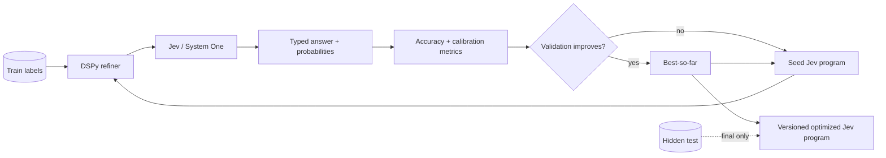

# DSPy × TypeSafe Jev Prompt Optimizer

A minimal outer-loop optimizer that uses **DSPy to propose better Jev question instructions/criteria**, evaluates each candidate with **TypeSafe AI Jev** on labeled examples, and keeps candidates that improve held-out accuracy.

The important separation is:

- **Jev** is the typed probabilistic decision engine being optimized.
- **DSPy** is the proposal/refinement layer generating candidate Jev programs.
- **Ordinary Python** owns the evaluation loop, dataset isolation, acceptance rule, and final deployment artifact.

## Architecture



The editable Mermaid source is [`architecture.mmd`](architecture.mmd). The repository workflow renders it with Mermaid CLI 11.17.0 into both vector SVG and a high-resolution PNG.



## What the starter optimizes

The included example optimizes a single Jev `Choice` question for support routing. DSPy can change:

- the Jev `instructions`;
- the descriptions in `criteria`;
- wording that distinguishes confusing classes.

The label keys are immutable. The optimizer rejects proposals that change them.

The same pattern can be extended to search over **question decomposition, Choice/Noul/Score composition, thresholds, and weights**. Keep those higher-level transformations explicit in code rather than letting a text model silently change application policy.

## Dataset contract

Each JSONL row contains structured Jev state and a ground-truth label:

```json
{"state":{"ticket":"I was charged twice."},"expected":"billing"}
```

The starter splits the dataset deterministically into:

- **60% train** — used to discover failures;
- **20% validation** — used to accept/reject prompt candidates;
- **20% hidden test** — touched once after prompt search is finished.

For serious benchmarking, provide a larger private test set and keep it out of the DSPy proposal context entirely.

## Run

Python 3.10+ is required.

```bash
python -m venv .venv
source .venv/bin/activate  # Windows: .venv\\Scripts\\activate
pip install -e .

export TYPESAFE_API_KEY="..."
export OPENAI_API_KEY="..."          # if the DSPy proposal LM is OpenAI
export DSPY_LM="openai/gpt-5.4-mini" # replace with any DSPy-supported LM

python optimizer.py --dataset sample_dataset.jsonl --iterations 6
```

Outputs are written under `runs/latest/`:

- `best_program.json` — deployable Jev instructions + criteria;
- `history.json` — every proposal, hypothesis, score, and acceptance decision;
- `final_metrics.json` — validation metrics and the single hidden-test evaluation.

## Selection objective

The starter prioritizes **held-out classification accuracy** exactly as the optimization target. Multiclass Brier score is used only as a tie-breaker, while Macro-F1 is logged for diagnostics.

For an imbalanced or risk-sensitive task, replace the acceptance rule with the metric that matches the application consequence: Macro-F1, MCC, weighted loss, false-negative cost, Brier score, calibration error, latency, or a constrained multi-objective score.

## Why not wrap Jev as a normal DSPy LM?

Jev is designed for typed judgments and probabilities rather than open-ended text generation. This starter therefore keeps Jev as the target system and uses a normal DSPy-supported generative LM to propose new Jev programs. That preserves Jev's intended programming model while still giving DSPy an optimization role.

## Safety against benchmark overfitting

Do not repeatedly optimize against the test set. The loop only uses training failures for proposal context and validation results for candidate selection. The hidden test is evaluated after optimization has stopped.

For production research, also consider:

1. a second shadow test corpus that remains private until final reporting;
2. stratified splits and repeated seeds;
3. per-class confusion matrices and calibration plots;
4. frozen Jev model/version metadata and prompt hashes;
5. cost/latency accounting per iteration;
6. a baseline comparing hand-authored Jev against DSPy-optimized Jev.

## Files

| File | Purpose |
|---|---|
| `optimizer.py` | DSPy proposal loop + Jev evaluator |
| `sample_dataset.jsonl` | Tiny runnable example dataset |
| `architecture.mmd` | Full editable Mermaid architecture |
| `architecture.svg` | Mermaid CLI vector render (generated in CI) |
| `architecture-hd.png` | High-resolution Mermaid render (generated in CI) |
| `pyproject.toml` | Minimal Python dependencies |

## Current API assumptions

The code follows the current TypeSafe Python SDK pattern using `TypeSafeClient.system_one(...)` with a typed `Choice` question, and reads the returned choice and probability distribution. The helper `_typed_choice` tolerates both the SDK's typed `choices` view and `answers` view so the starter is resilient across the currently documented access patterns.
